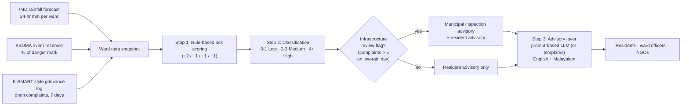

# Step 3 — Ideate the AI Workflow

> **Deliverable for the assignment:** a clear description of the AI's role — (a) risk scoring that combines rainfall + drain complaints into Low/Medium/High, and (b) a conversational/prompt layer that turns the score into a plain-language advisory in the local language.

## The workflow in one line

**Two weak signals in → one explainable risk score → one advisory a resident can act on.**



## Role (a) — Risk scoring (rule-based, explainable by design)

This is deliberately **not** a trained ML model. A rule-based scorer is auditable by a ward officer, defensible in a press conference, and works from day one with tiny data. Every score can be traced to its contributing factors — which is exactly what a public warning system needs.

### Scoring rules (per ward, per day)

| Signal | Condition | Points |
|---|---|---|
| Rainfall (24 hr) | > 100 mm | **+2** |
| Rainfall (24 hr) | 50–100 mm | **+1** |
| Drain-blockage complaints | > 5 in past 7 days in the ward | **+1** |
| River/reservoir level | > 80% of danger mark | **+1** |

### Classification

| Total score | Risk level | Meaning |
|---|---|---|
| 0–1 | 🟢 **Low** | Normal precautions |
| 2–3 | 🟡 **Medium** | Prepare; avoid risk-prone movement |
| 4+ | 🔴 **High** | Act now; avoid low-lying travel, keep emergency kit ready |

### The "insight beyond prediction" flag

When **complaints > 5 but rainfall contributes 0 points** (dry-day infrastructure risk), the system flags the ward for **municipal inspection** — surfacing an infrastructure problem *independent of weather*. (This is Scenario C.)

## Role (b) — Advisory generation (conversational / prompt layer)

The risk score alone ("Ward 12 — 4, High") is not communication. The advisory layer turns **risk level + ward name + contributing factors** into a plain-language message in the resident's language. Two interchangeable implementations behind the same interface:

### Implementation 1 — Template engine (used in the offline demo; deterministic, no API needed)

- `High` → names the drivers, one action rule (avoid low-lying roads, timing), one preparedness rule (emergency numbers/kit).
- `Medium` → headsup + prepare (move vehicles/documents up, expect waterlogging in known spots).
- `Low` → reassurance + normal precautions; if the infrastructure flag is set, add the municipal-inspection message.
- Malayalam rendering provided for the High-risk template as a sample of local-language output.

### Implementation 2 — Prompt-based LLM layer (Claude-style; documented as the "real system" design)

The system builds a structured prompt from the same inputs and asks the LLM to draft the advisory; a validation step (ward officer or rule check) approves before broadcast.

```text
SYSTEM: You are the advisory writer for JalRakshak, a flood early-warning assistant
for urban wards in Kerala. Write for a resident with no technical background.

USER:
Ward: Ward 12, Kaloor North (low-lying: yes)
Risk level: HIGH (score 4 of max 5)
Contributing factors:
  - 24-hr rainfall: 130 mm  (contributes +2: heavy rain)
  - Drain complaints (7 days): 7  (contributes +1: drainage likely obstructed)
  - Reservoir level: 90% of danger mark (contributes +1: system already stressed)
Context: Monsoon season; advisory will be sent as an SMS and voice message.

TASK: In <= 60 words, write one advisory in simple English and one in Malayalam.
Include: (1) the risk in everyday words, (2) ONE thing to avoid, (3) ONE thing to keep ready.
Do not use technical terms, numbers of the scoring rules, or words that cause panic.

OUTPUT FORMAT:
EN: <advisory>
ML: <advisory>
```

**Why a prompt layer (RAG-style) rather than more templates:** complaint *text* is unstructured ("water not draining near market road", "gutter overflowing behind school"). In the full design, an LLM classification pass maps complaint text to categories, and the advisory prompt can then quote the *worst verified complaint location* ("avoid the road behind the market") — a level of specificity templates alone cannot reach. For the MVP demo the template engine stands in; the prompt layer is documented and shown via the `build_llm_prompt()` output in `output/advisory_prompts.txt`.

## Worked examples (from the prototype — exact spec scenarios)

| Scenario | Input (rain / complaints / reservoir) | Score | Risk | Output advisory |
|---|---|---|---|---|
| **A** | 130 mm / 7 / 90% | 2+1+1 = **4** | High | "High flood risk in Ward 12. Heavy rain combined with unresolved drainage complaints increases risk. Avoid travel through low-lying areas." |
| **B** | 60 mm / 2 / 60% | 1+0+0 = **1** | Low | "Low flood risk in Ward 5 today. Normal precautions advised." |
| **C** | 40 mm / 8 / 70% | 0+1+0 = **1** | Low + 🚩 review | "Low rainfall risk, but Ward 9 has a high number of unresolved drain complaints — recommend municipal inspection regardless of rainfall." |

Scenario C is the differentiator: the assistant surfaces an infrastructure risk **independent of weather** — insight beyond prediction.

## Communication plan per audience

| Audience | Channel | What they receive |
|---|---|---|
| Residents | SMS / voice note in Malayalam + English | The advisory text only |
| Ward officer | Dashboard / report | Score, contributing factors, flagged complaints list |
| NGOs & volunteers | Group alert | Risk level + ward list, pre-positioning hint |
